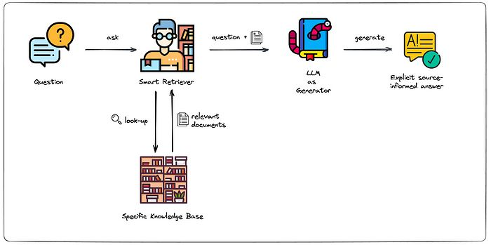
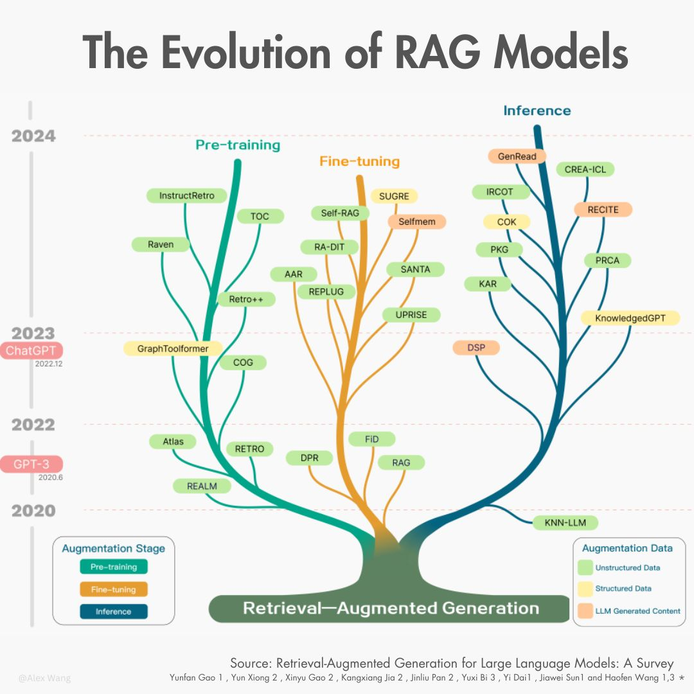
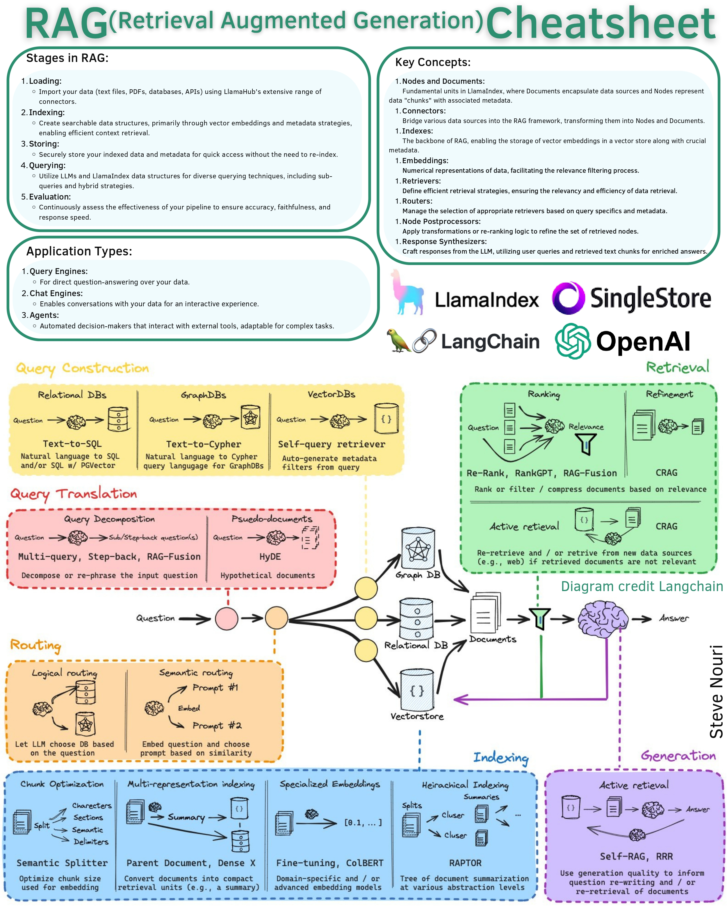
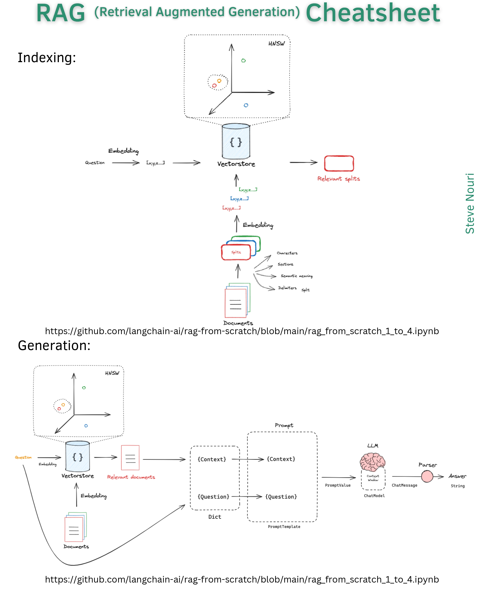
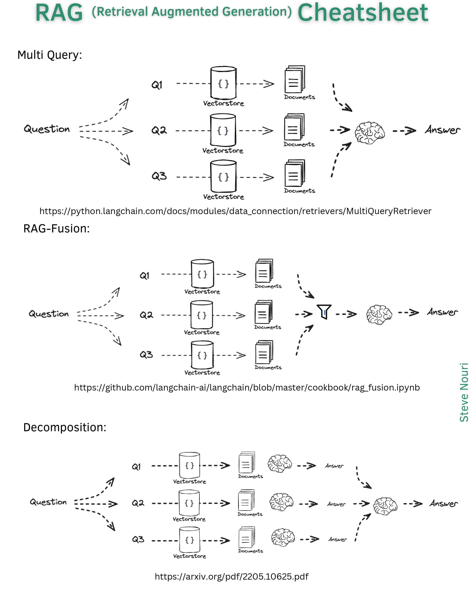
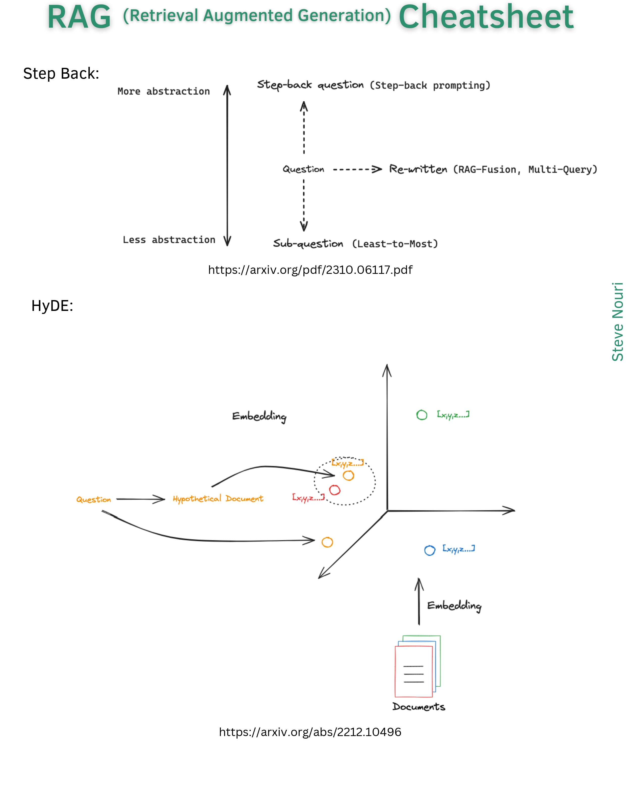
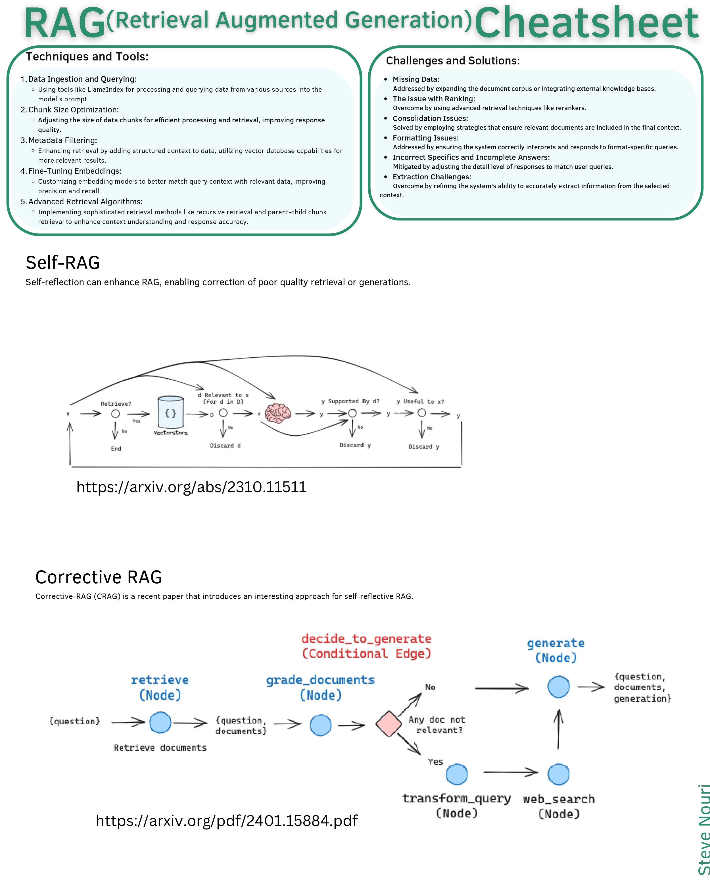

Learn about RAG
===============

:Version: 2024-10

Source:

- https://www.linkedin.com/posts/youssef-hosni-b2960b135_rag-is-one-of-the-easiest-ways-to-build-llm-activity-7161388237284876288-Q4ha?utm_source=share&utm_medium=member_desktop
- https://www.linkedin.com/posts/stevenouri_rag-activity-7164902842330275840-HN23?utm_source=share&utm_medium=member_desktop
- https://www.linkedin.com/posts/alexwang2911_rag-generativeai-llms-activity-7194932416321343488-S1v8?utm_source=share&utm_medium=member_desktop

Introduction to RAG
-------------------

**RAG** is one of the easiest ways to build LLM applications over your own data, however building a production-level RAG can be challenging. Here are five ways to improve your RAG pipeline:

(1) **Enhancing Retrieval** : The retrieval aspect of RAG essentially functions as a search engine. Implementing hybrid retrieval techniques, combining lexical and vector-based methods, alongside cross-encoder re-ranking, can significantly enhance the retrieval of relevant data.

(2) **Data Standardization** : Data utilized by RAG often originates from diverse sources, leading to varied formats and potential artifacts. Establishing a robust data preprocessing pipeline, whether through manual curation or leveraging LLM-based judgment, ensures proper standardization, filtering, and extraction of data, mitigating artifacts that may hinder the understanding by the LLM.

(3) **Crafting Effective Prompts** : Effective application of RAG hinges not only on retrieving accurate context but also on prompt engineering. Crafting prompts that encompass relevant context and are formatted to elicit grounded responses from the LLM is crucial. Utilizing LLMs with expansive context windows and adopting strategies such as diversity and lost-in-the-middle selection facilitate optimal incorporation of context into prompts.

(4) **Rigorous Evaluation** : Developing repeatable and accurate evaluation pipelines for RAG, assessing both the overall system performance and individual components, is imperative. Utilizing standard search metrics like DCG and nDCG for evaluating the retrieval pipeline and employing LLM-based judgment for evaluating the generation component ensures comprehensive assessment. Leveraging systems like RAGAS facilitates the evaluation of the complete RAG pipeline.

(5) **Continuous Data Collection** : Post-deployment of the RAG application, ongoing data collection is vital for continual improvement. Strategies such as finetuning retrieval models based on relevant query-text pairs, refining LLMs using high-quality outputs, and conducting AB tests to quantitatively measure pipeline enhancements contribute to performance optimization over time.

RAG State of the art
--------------------

The term Retrieval-Augmented Generation (RAG) was first introduced in a paper by a team at Facebook AI Research in 2020, as a way to improve the accuracy and reliability of generative AI models by fetching facts from external sources.

Initially, RAG focused on using unstructured data, but it has expanded to incorporate high-quality structured data, like knowledge graphs, to address issues like hallucinations and incorrect knowledge.

Recently, researchers have also started exploring self-retrieval, which involves using LLMs' own knowledge to enhance their performance.

The image is from the paper 'Retrieval-Augmented Generation for Large Language Models: A Survey', last revised on Mar 2024; which should be a great read.

RAG Cheatsheet
--------------

RAG combines the vast knowledge of LLMs with your data, enhancing AI's ability to provide contextually rich responses.

It leverages existing LLM data and enriches it with your unique datasets through a process of loading, indexing, storing, querying, and evaluation.

Page 1

Page 2

Page 3

Page 4

Page 5

